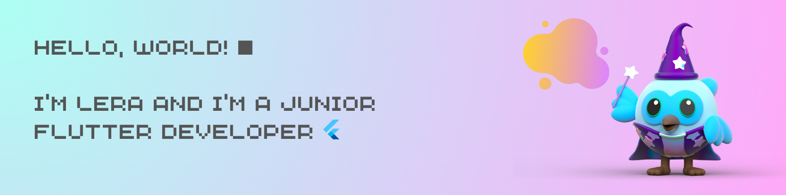

### Hello, world 🪐

  

- 🔮 I’m currently working with a good team and growing as developer
- 🌎 Working on my TravelApp project
- 🐸 Enjoynig my best life

***

 ### 🎯 Some of my stats

 
 
***

### 👾 Tool and programms
           

